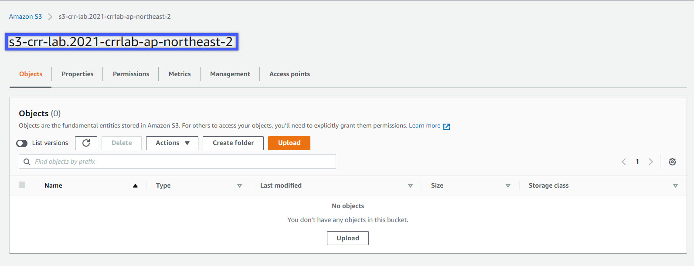

# AWS-Implemented-CRR-S3 
### Tác Giả: 

Seth Eliot, 

Principal Reliability Solutions Architect,

AWS Well-Architected

### Giám Sát / Hướng Dẫn

Mr. Hung Nguyen Gia,

AWS Authorized Instructor Champion

### Người Thực Hiện

Mr. Minh Hung Le 

AWS Certified Cloud Practitioner

**On-training**: AWS Certified Solution Architect - Associated

---

### Giới Thiệu
Bài lab này sẽ hướng dẫn các bạn thực hiện từng bước (step-by-step) để gia tăng độ tin cậy (reliability) cho dịch vụ và dữ liệu của các bạn bằng cách sử dụng tự động hoá sao lưu dữ liệu không đồng bộ (Automatic Asynchronous Backup) của dữ liệu đã mã hoá (encrypted data) mà bạn lưu trữ trên AWS S3. Nhờ vào đó mà dữ liệu của bạn sẽ được sao lưu (backup) một cách tự động đến 1 vùng khác của AWS 

Sau đây là mô hình kiến trúc đơn giản của bài lab: 

---
### Mục Tiêu
* thực hiện việc backup dữ liệu tự động cho đối tượng(object) hoặc file hoặc data nói chung mà bạn lưu trữ trên S3 bucket
* Bảo mật và mã hoá dữ liệu (data) sao lưu trên S3
* Tự động hoá việc khôi phục dữ liệu sau thảm hoạ đột biến xảy ra (Automate Disaster Recovery – DR)của dữ liệu trên S3
* Truy vấn dịch vụ CloudTrail log để gia tăng việc hiểu biết về CRR đã hoạt động như thế nào. 
---
### Chú Ý
* Nếu bạn sử dụng tài khoảng AWS được cung cấp từ workshop (đại học, lớp học online, v.v.v) thì những đều khoảng sau sẽ thoả mản được yêu cầu của bài lab này. 
* Trường hợp nếu bạn sử dụng tài khoảng AWS của chính bạn, thì hãy hoàng thành và/hoặc kiểm tra những bước cấu hình sau để đáp ứng được yêu cầu bài lab:
* Tài khoảng AWS bạn dùng để thực hiện bài lab này thì khuyến khích là không nên sử dụng nó cho mục đích nào khác. Thi dụ như là bạn nên có 1 tài khoảng khác riêng cho việc payment, production.
* Tạo 1 IAM (Identity and Access Management) user hoặc gán một federated credentials vào tài khoảng đó có quyền như sau:
    * Create S3 bucket and bucket policies
    * Get and Put data into S3 buckets
    * Create CloudTrail trails and CloudWatch Log Groups
Quan trọng: Để hoàng thành bài lab này, bạn CÓ THỂ sẽ phải trả 1 khoảng phí nhỏ ($0.01 cent ~ $1) cho AWS về việc sử dụng AWS Resources NẾU resource đó không được AWS hỗ trợ trong phần Account FREE Tier. 
* Trong bài lab này bạn sẽ thực hiện 3 S3 PUT, lưu trữ file khoảng 1MB vào 2 S3 bucket
* Sau đó, chuyển data đó qua 1 khu vực khác (transfer data from one to another region)
* Tổng chi phí khoảng chừng $0.01 cent với điều kiện bình thường thì sẽ KHÔNG có bất cứ khoảng phí tích luỹ nào cho bài lab này
* Xin vui lòng chú ý là hãy XOÁ hết tất cả resources đã sử dụng sau khi hoàng thành bài lab. 
---
### Thực Hiện
### 1. Triển Khai CloudFormation (CF) Infrastructure
##### 1.1 Logging vào AWS Console
##### 1.2 Triển khai cơ sở hạ tầng vào 2 AWS Regions bằng cách sử dụng AWS CloudFormation (CF) template 
*Bạn có thể download file **s3_bucket.yaml** trong folder đính kèm*
###### Triển khai vùng đầu tiên 
Thì tuỳ theo nơi bạn ở, của mình sẽ là Sydney AWS AP-South East 2
* Sử dụng drop-down menu để chọn vùng AWS thích hợp

* Tìm dịch vụ CloudFormation(CF) trong AWS console

* Tìm dịch vụ S3 trong AWS Console và vào S3 để check xem khi chưa làm gì thì không có bất cứ bucket/object nào trong đó

* Trong phần AWS Console, chọn CF để vào CF Console. Và tạo Stack (Create Stack)

* Tạo CF Stack (hoàng toàn mới) bằng cách sử dụng file *s3_bucket.yaml* => Sau khi upload xong => NEXT

* Stack name: sử dụng tuỳ ý nhưng khuyên là: *S3-CRR-lab-east*
* NamingPrefix: Rất quan trọng vì nó tạo S3 bucket. Do vậy, NamingPrefix phải Ngắn và Duy Nhất (Short & Unique). Sau khi xong thì bấm NEXT. Nhớ COPY cái NamingPrefix mà bạn điền vào ra Notepad. Nếu về sau tạo stack FAILED phải làm lại từ đầu thì cũng phải copy cái NamingPrefix và update trong Notepad.

* Qua Step 3 => không cần làm gì => Next 
* Đến trang cuối cùng (Step 4) thì chú ý rằng nếu có lỗi thì AWS thường thông báo trên đầu 1 thẻ đỏ chót. Bạn nhớ chú ý xem có hay không. Nếu có thì nên tự động dịch ra và google. Vì đây chính là học Cloud. Tuỳ theo lỗi đó là gì, có thể hoặc không có thông báo. Sau đó cuộn xuống cuối trang và làm theo hình

* Stack khi đã được tạo thành công

* Stack khi tạo failed: **ROLLBACK_COMPLETE** là 1 trong những lỗi thường gặp. Bạn qua tab Events check xem lỗi như thế nào. Mình bị lỗi này và đọc thì thấy ý nó nói là mình tạo tên quá dài.
    * Cách khắc phục: Rất đơn giản => xoá hết làm lại từ đầu (tạo stack mới). đến khi Được thì thôi

* Sẽ mất 1 lúc để CF làm việc.
* Trong lúc này, bạn vào drop-down menu góc trái bên trên để chọn 1 region khác thích hợp. Mình chọn là Seoul => AWS AP-NorthEast2

* LÀM LẠI TỪ BƯỚC VÀO CF CONSOLE VÀ TẠO STACK MỚI CHO  **REGION VỪA MỚI ĐỔI**
* CHÚ Ý LÀ: NAMINGPREFIX Ở REGION 2 (MỚI ĐỔI QUA) PHẢI GIỐNG LÚC ĐÃ TẠO Ở REGION 1 => Lý do ở trên nhắc các bạn copy NamingPrefix
* Sau khi đã hoàng thành xong phần Deploy CF Infrastructure ở cả 2 regions thì:
    * CF (cả 2 Regions) : Chọn stack => Value => Copy cái value ra notepad
     
    * S3: Check tài nguyên trong S3 đã được khởi tạo, so sánh tên Value để chắc rằng tạo đúng. 
    
---
### 2. Cấu hình Bi-Directional Cross-Region_Replication (CRR)
##### 2.1 Tạo Rule để replicate từ Region 1 qua Region 2
* chú ý là Region 1 hoặc 2 có nghĩa là hoàng toàng theo thứ tự bạn sắp xếp miễn sao đừng nhầm là được
* Trong bài lab, mình sẽ cấu hình **Sydney** trước
* Nếu đã vậy thì region còn lại sẽ là region 2, trong bài lab này, region 2 của mình là **Seoul**
* Trước khi config, mình sẽ check S3 Bucket phía Seoul ==> hoàng toàn không có gì

* Vào S3 bucket của bạn và chọn region đầu tiên, của mình sẽ là **Sydney**
* Chọn Management tab và sau đó chọn Create Replication Rule

* Làm theo hình từ trên xuống
* Chú ý:
    * Phần Destination: chọn nơi mà bạn sẽ **Replicate Đến** => Của mình là Seoul (Northeast-2)
    * Phần IAM Role: chọn role của **Region mà bạn đang cấu hình** => của mình là Sydney (Southeast-2)
    * 2 cái vừa nêu rất dễ nhầm do cách viết tên cũng như có quá nhiều cái để chọn. 

    * Sau cùng click **SAVE**

##### 2.2 Test Replication Rule
* Bạn download hình **TestObject_AmazonRufus.gif** trong folder images đính kèm về
* Sau đó upload image vào region 1 (Sydney)
* Sau khi upload xong, thì qua bucket của region 2 (Seoul - AP Northeast-2) để check. Sẽ thấy hình **TestObject_AmazonRufus.gif** ở trong region 2 (Seoul) ==> Thành công. 

* **TƯƠNG TỰ, BẠN QUA REGION 2 CẤU HÌNH REPLICATION RULE = > MÌNH LÀ SEOUL - AP NORTHEAST-2**
* **CÁCH LÀM Y CHANG LÚC BẠN CẤU HÌNH BÊN REGION 1, CHÚ Ý DESTINATION VÀ IAM ROLE. NẾU BẠN HIỂU CÁCH NÓ HOẠT ĐỘNG THÌ SẼ KHÔNG CHỌN SAI**
* Ngoài ra, bạn cũng có thể thử bằng cách upload hình ảnh/flat file lên s3 ở 1 trong 2 bucket. Sau đó check bucket còn lại. 
* Mình có cung cấp thêm 2 hình test là **TestObject_OhioAwsEast.png** và **TestObject_OregonAwsWest.png**
* Khi 1 file **Được** upload, thì bạn chọn file đó vào phần **Properties** sẽ thấy là **Replication Status: COMPLETED**

* Khi 1 file **REPLICATE** thành công thì check properties sẽ thấy là **REPLICA**

---
**SAU KHI HOÀNG THÀNH LAB, NHỚ XOÁ HẾT TẤT CẢ NHỮNG GÌ ĐÃ LÀM ĐỂ TRÁNH VIỆC CHI TRẢ PHÍ AWS KHÔNG MONG MUỐN.**

